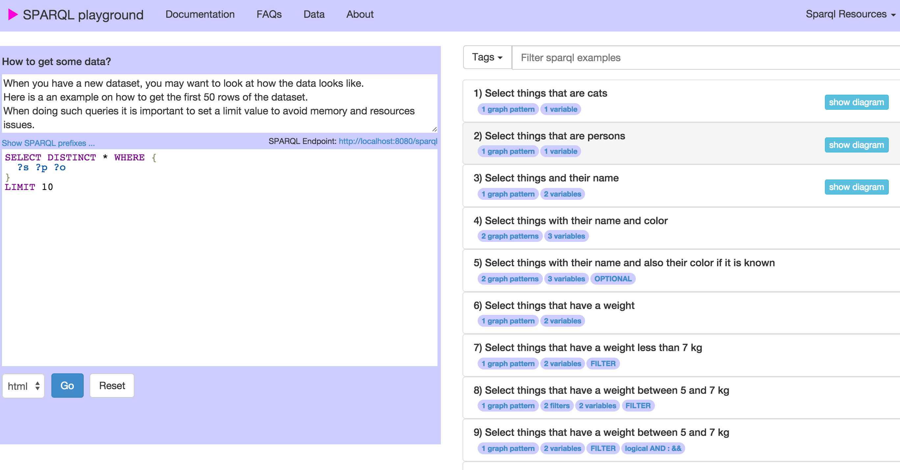

# Sparql Playground

SPARQL playground is a standalone multi-platform Java Spring Boot and AngularJS web application used to learn SPARQL. It uses Sesame 2.7.9 as Sparql Engine. It is beeing developed at the <a target="_blank" href="https://www.isb-sib.ch/">Swiss Institute of Bioinformatics</a>.  

##Installation
* Download the [latest release](https://github.com/calipho-sib/sparql-playground/tarball/master)
* Unzip and enter the folder, then run: `java -jar sparql-playgroud.war` (requires Java 1.7 or higher)
* Once the application started you should open your browser on: <a href="http://localhost:8080" target="_blank">http://localhost:8080</a>

* Select the examples and click on the GO button

##Predefined RDF datasets

There are some datasets predefined:

* Uses default dataset (cats and dogs): `java -jar sparql-playgroud.war`

* Uses a sample of neXtProt dataset: `java -jar sparql-playgroud.war nextprot`

* Uses a sample of UniProt dataset `java -jar sparql-playgroud.war uniprot `

##Create your own RDF dataset (and collaborate)

* You can create your own dataset by giving a directory as argument: `java -jar sparql-playgroud.war your-directory-name`

Your directory should follow this convention:

* ttl-data: a folder containing turtle file(s)
* queries: a folder containing the queries showed in the first page
* prefixes.ttl: a file containing the default prefixes (optional)
* pages: pages with markdown files for the Documentation
* config.properties - optionally you can include this property file with: repository.type=native to create a native repository (instead of memory)
* Optionally you can collaborate with your dataset, simply by doing a pull request. 

##Technology in use
* The SPARQL engine is Sesame 2.7.9
* The backend uses Spring Boot 1.2.3
* The frontend is build with angularJS 1.3 and bootstrap 3
* Requires Java 1.7 or higher

#License

The project is opensource and free under the GNU GPL v2 License. The sources are available on <a target="_blank" href="https://github.com/calipho-sib/sparql-playground">GitHub</a>.

This project was forked from the <a target="_blank" href="http://snorql.nextprot.org/">neXtProt snorql interface.</a>

#Contact

For any related questions do not hesitate to <a href="mailto:support@nextprot.org">contact us</a>.
