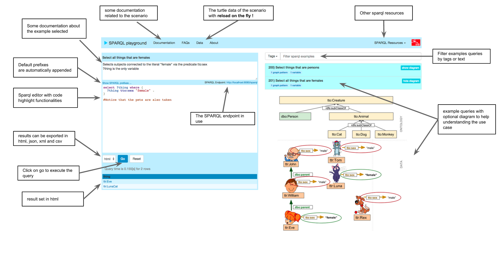

# Sparql Playground

SPARQL playground is a standalone multi-platform web application used to learn SPARQL (implemented in Java Spring Boot and AngularJS). 

It uses Sesame 2.7.9 as SPARQL Engine. 

It is beeing developed at the <a target="_blank" href="https://www.isb-sib.ch/">SIB Swiss Institute of Bioinformatics</a>.  

You can see a live demo here: http://sparql-playground.isb-sib.ch/

You can also see a live version of nextprot samples here: http://sparql-playground.nextprot.org/

##Installation
* Download the [latest release](https://github.com/calipho-sib/sparql-playground/tarball/master)
* Unzip the folder and run the start script (start.bat for windows users or start.sh for unix users) (it requires java 1.7 or higher)
* Once the application started you should open your browser on: <a href="http://localhost:8888" target="_blank">http://localhost:8888</a>

* Select the examples and click on the GO button

##Predefined RDF scenarios / datasets

There are some scenarios predefined:

* Default scenario comes with less than 100 triplets and does not require any domain knowledge (persons and their pets), run the `start.sh` (Linux, Mac) or `start.bat` (Windows) script

* neXtProt helps you understand the neXtProt rdf model, run the `start-nextprot.sh` (Linux, Mac) or `start-nextprot.bat`  (Windows) script

* UniProt helps you understand the UniProt rdf model, run the `start-uniprot.sh` (Linux, Mac) or `start-uniprot.bat` (Windows) script

## Slides of the presentations

* <a href="assets/BC2-sparql-tutorial-introduction.pdf" target="_blank">Introduction to RDF and SPARQL</a>
* <a href="assets/BC2-sparql-tutorial-nextprot.pdf" target="_blank">RDF and SPARQL within neXtProt</a>
* <a href="assets/BC2-sparql-tutorial-uniprot.pdf" target="_blank">RDF and SPARQL within UniProt</a>
* <a href="assets/BC2-sparql-tutorial-federated.pdf" target="_blank">Federated queries using neXtProt and UniProt</a>
* <a href="assets/BC2-sparql-tutorial-additional.pdf" target="_blank">Additional slides about RDF and SPARQL</a>

##Create your own RDF scenario (no programming skills are required) 

* You can create your own scenario by giving a directory as argument: `java -jar sparql-playgroud.war your-directory-name`

Your directory should follow this convention:

* ttl-data: a folder containing turtle file(s)
* queries: a folder containing the queries showed in the first page 
* prefixes.ttl: a file containing the default prefixes (optional) to be added to queries
* pages: pages with markdown files for the Documentation tab
* config.properties - optionally you can include this property file with: repository.type=native to create a native repository (instead of in memory). This is particulary useful if your dataset contains more than 100'000 triplets

If you like you can share your dataset with us.

##Technology in use
* The SPARQL engine is Sesame 2.7.9
* The backend uses Spring Boot 1.2.3
* The frontend is build with angularJS 1.3 and bootstrap 3
* Requires Java 1.7 or higher

#License

The project is opensource and free under the GNU GPL v2 License. The sources are available on <a target="_blank" href="https://github.com/calipho-sib/sparql-playground">GitHub</a>.

This project was forked from the <a target="_blank" href="http://snorql.nextprot.org/">neXtProt snorql interface.</a>

#Contact

For any related questions do not hesitate to <a href="mailto:support@nextprot.org">contact us</a>.
