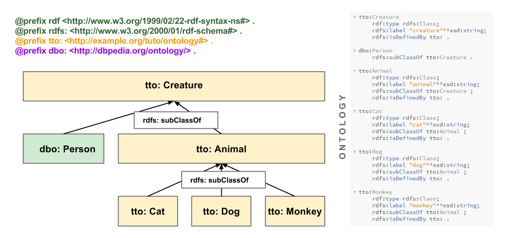
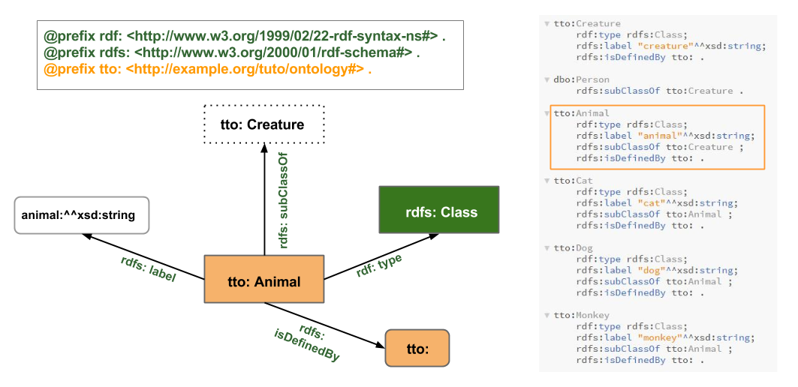
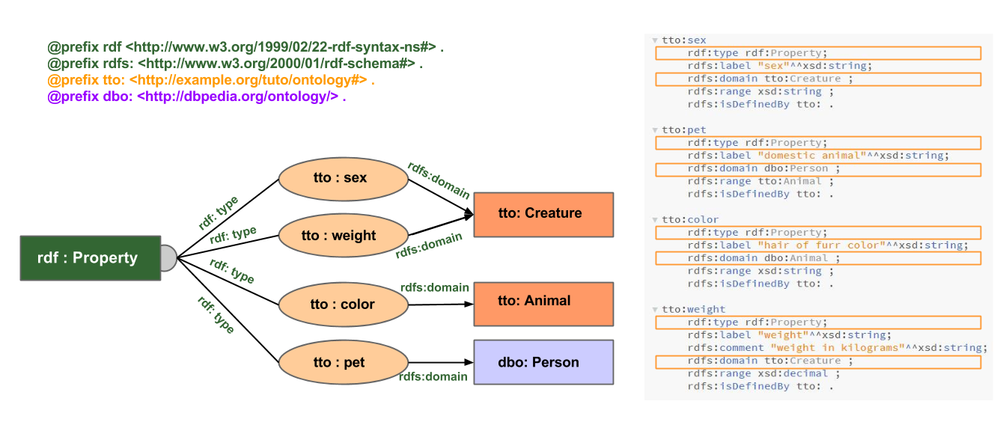

#Ontology

In this page you can learn about recommended practices / conventions when defining classes and properties.

#Classes 

A class should be defined by owl:Class or rdfs:Class

#Animal class in depth
Here is the example of the class tto:Animal and the properties attached (old diagram with owl instead of rdfs)

#Properties in detail
Here we see how properties are attached to the domain. It is also recommended to attach them to their rdfs:range

