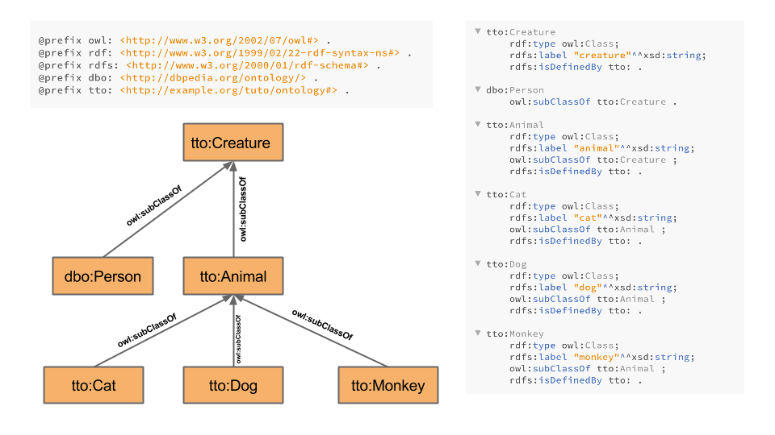

#Scenario ontology
In this example we will introduce a very simple scenario with pets. cats, dogs and monkey that are subclasses of animals.

The ontology and resources for this tutorial be found under [the data tab](data), but a schematic representation will be documented here for better understanding.

##Relationship between classes

##Class in details
This is a simplified version. If we were about to draw every triplet we would have something like this:

