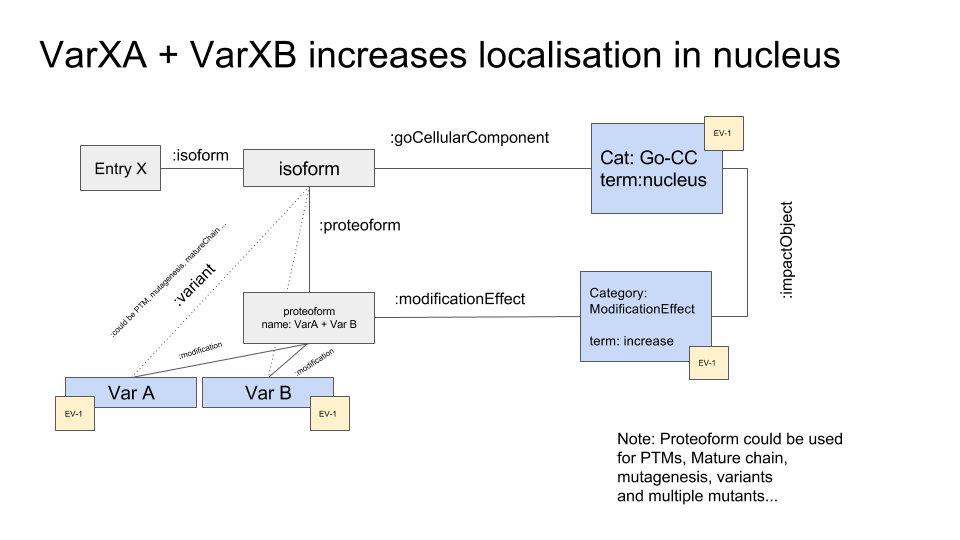

#Phenotypes

Since neXtProt 2.0 (released in September 2016), the RDF model has evolved to express phenotypes related to variants.

A variant can be seen as an isoform that have been modified. An isoform containing this modification is called a proteoform.

The following model shows how the model is designed.

One can ask for example: Proteins with a variant having an impact on the nucleus localization at level GOLD

These examples are not yet available on the neXtProt playground, but can be found on the production website.

See in neXtProt <a href="https://www.nextprot.org/proteins/search?mode=advanced&queryId=NXQ_00147" target="_blank">this example.</a>

